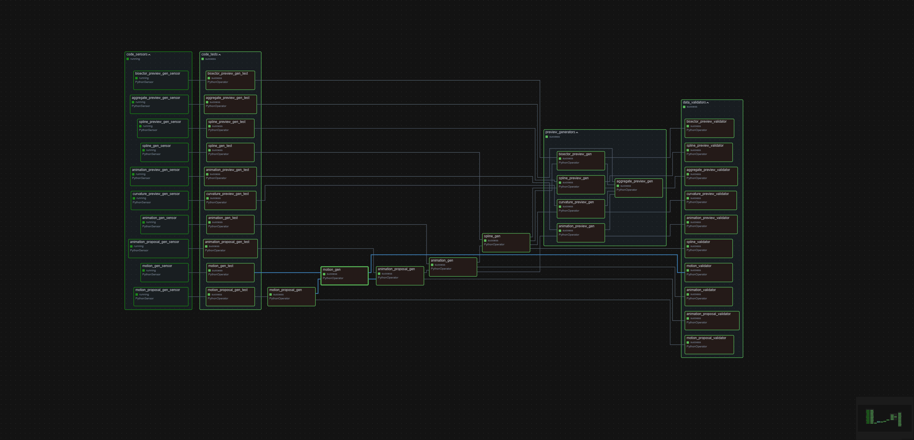

    Change Log
    ===========

    2025-05-16: Initial release.
    2025-05-17: Cleanup and minor tweaks.

## ⚛️ Embedded Pendulums

Embedded Pendulums is a data pipeline to experiment with joints in motion and the path of their effectors.

The pipeline is designed to be run in a Docker container and uses Apache Airflow for orchestration. It processes data from multiple pendulums, simulating their motion and generating visualizations of their paths.

## 📂 Repository Contents

- **`/src`**: Core implementation of the pipeline, including io, test, validation and transformation logic.
- **`/data`**: Example input and output datasets.
- **`/dags`**: Entry point for running the development graph.

## ⚙️ Getting Started

### Prerequisites

- Git
- Docker
- Visual Studio Code (optional, but recommended for development)

### Installation

1. Clone the repository:
   ~~~bash
   git clone https://github.com/hutchisonkim/embedded_pendulums.git
   ~~~

2. Build and start the container:
   ~~~bash
   docker-compose up --build
   ~~~

## 💻 Running the Code
### Pipeline Evaluation

1. Start a run on the pipeline:
   - Browse to `http://localhost:8080/dags/embedded_pendulums_development_dag/`
   - Trigger the DAG by clicking on the "Trigger DAG" button (the play icon) in the top right corner

2. View the results:
   - The output PNG and CSV files will be available in the `/data/` folder
   - Log files for each task and run can be found in the `/logs/` folder

##  ✒️ Dev Features

- ### Test Tasks

    Between each sensor and generator task pair is a test task to catch any failure introduced by the code file changes detected by the sensor task.

- ### Validation Tasks

    After each generator task is a validator task that checks the generated data against its schema.

- ### Hot Reload DAG

    Sensor tasks are used to monitor changes in the code files. When a change is detected, the downstream tasks get cleared, causing a partial rerun of the DAG.
   

## 📼 DAG Preview

